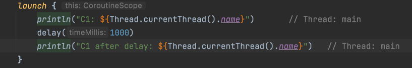
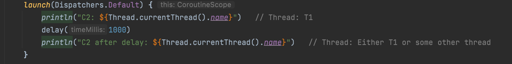
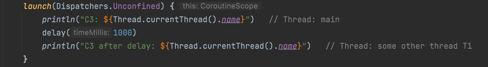
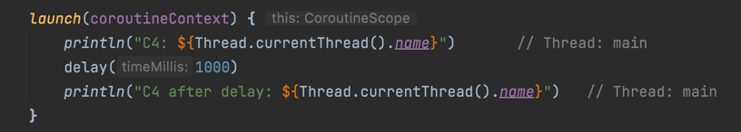

## Kotlin Coroutines Tutorials/Programs
### About this project:
* If you want to get started with Kotlin Coroutines, then may be this project is for you. Learn Kotlin Coroutines, its basics and Fundamentals from scratch. 
## Key Points :

### 1.What are Coroutines?
   - Light-weight Threads but **`Coroutines != Thread.`**
   - Like Thread Coroutines can run in parallel/Concurrent, wait for each other, and communicate with each other.
   - Coroutines are very, very cheap - almost free, Creates thousands of them without any memory issue.
   - It is best for modern application.

### 2. How are they related to Threads?
   - In case of Thread, Application will wait to finish until all the threads finish.
   - Un-like threads, for coroutines the application by default doesn't wait for it to finish its execution.(Means, application will not wait for coroutines to finish, it will finish the program automatically).

### 3. Coroutines Builders?
   - Coroutines Builder are used to create Coroutines.

### 4. Types of Coroutines Builders?

#### A. launch [Fire and Forget]
   - Launches a new Coroutine **_without blocking the current thread_**.
   - Inherits the thread and coroutine scope of immediate parent coroutine.
   - Return the reference of **Job object**.
   - Using Job object you can cancel or wait for the coroutine to finish. 
#### B. async
   - Launches a new Coroutine without blocking the current thread.
   - Inherits the thread and coroutine scope of immediate parent coroutine.
   - Return the reference of **`Deferred<T>`** object, Which is subclass of Job object.
   - Using DeferredObject you can cancel or wait for the coroutine to finish.
   - We can use that return value `[val deferredValue = deferredJob.await()]`
   - In case to wait => If you don't want to use the return type then use **join()** else **await()**
#### C. runBlocking
- **runBlocking()** is generally used to write test cases to test the suspending functions.
- launch and async are non-blocking in nature but runBlocking() **blocks the thread**.
#### D. withContext
- It is used to switch Context.
- It's a suspending function, and it's cancellable by default.

### 5. Cancel Coroutine
#### A. Why Would you cancel a Coroutine?
- A: Result no longer needed.
- B: Coroutine taking too long to respond. etc.

#### B. How to cancel a Coroutine?
- To cancel a Coroutine, it should be cooperative.
- **job.cancel()** => If the coroutine is cooperative then cancel it.
- **job.join()** => Wait for the coroutine to finish.
- **job.cancelAndJoin()** => If the coroutine is cooperative then cancel it else Wait for the coroutine to finish.
#### C. What is cooperative? and how to make Coroutine cooperative?
- Only those suspending functions that belongs to kotlinx.coroutines package will make coroutine cooperative.
- **`delay(), yield(), withContext(), withTimeOut()`** etc. are the suspending functions that belongs to **`kotlinx.coroutines`** package.
- There is another way to make coroutine cooperative => Explicitly check for cancellation status within the coroutine **`[CoroutineScope.isActive]`**

#### D. Handling Cancellation Exceptions?
- Cancellable suspending functions such as yield(), delay() etc. throw **CancellationException** on the coroutine cancellation.
- **NOTE :** We can't run suspending function from Finally block, because the coroutine running this code is already cancelled.
-  If we want to execute a suspending function from a finally block then wrap the code  within the **`withContext(NonCancellable)`** function
### 6. Timeout in Coroutine
#### withTimeout(timeMillis)
- Runs a given suspending **[block]** of code inside a coroutine with a specified **[timeout][timeMillis]** and throws a [TimeoutCancellationException] if the timeout was exceeded. 
#### withTimeoutOrNull(timeMillis)
- Runs a given suspending **[block]** of code inside a coroutine with a specified **[timeout][timeMillis]** and returns`null` if this timeout was exceeded.

### 7. Execution of Coroutines
#### A. Sequential Execution
- Function execution are sequential by default.
#### B. Concurrent Execution
- Achieve concurrent execution by async{ },launch{ }.
#### C. Lazy Coroutine Execution
- Lazily execute code in coroutine.
- **`val msg0 = async(start = CoroutineStart.LAZY) { print("AAA") }`**
- **`val msg1 = async (start = CoroutineStart.LAZY){ print("BBB")}`** 
- If we simply run the above code it won't print anything because we re not using the return type [msg0, msg1].
- In case of **`(start = CoroutineStart.LAZY)`** we should always use return value else [block] won't execute.

### 8. Dispatchers, CoroutineContext, and CoroutineScope
- Each coroutine has its own CoroutineScope.
- 
- launch{ } => Without Parameter: CONFINED => [CONFINED DISPATCHER]
- Inherits CoroutineContext from immediate parent coroutine.
- Even after delay() or suspending function, it continues to run in the same thread.

- 
- With parameter: Dispatchers.Default [similar to GlobalScope.launch { } ]
- Gets its own context at Global level. Executes in a separate background thread.
- After delay() or suspending function execution,it continues to run either in the same thread or some other thread.

- 
- Inherits CoroutineContext from the immediate parent coroutine.
- After delay() or suspending function execution, it continues to run in some other thread.

- 
- **`Dispatchers.Main`** => Main thread safety.
- **`Dispatchers.IO`** => Network Request or Disk read write.
- **`Dispatchers.default`** => CPU intensive task

## Author

* **Mukesh Kumar Patel** 
